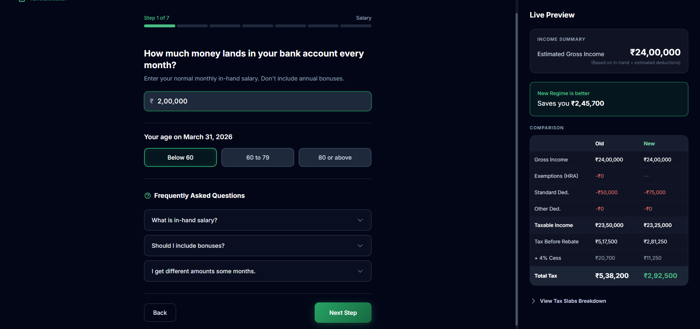
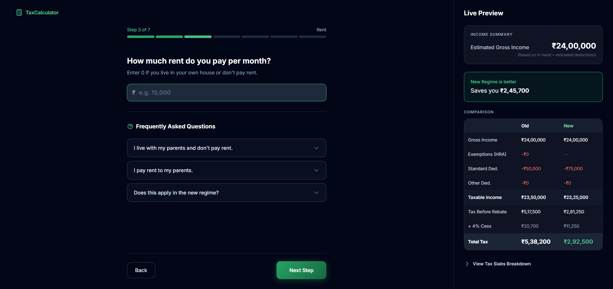
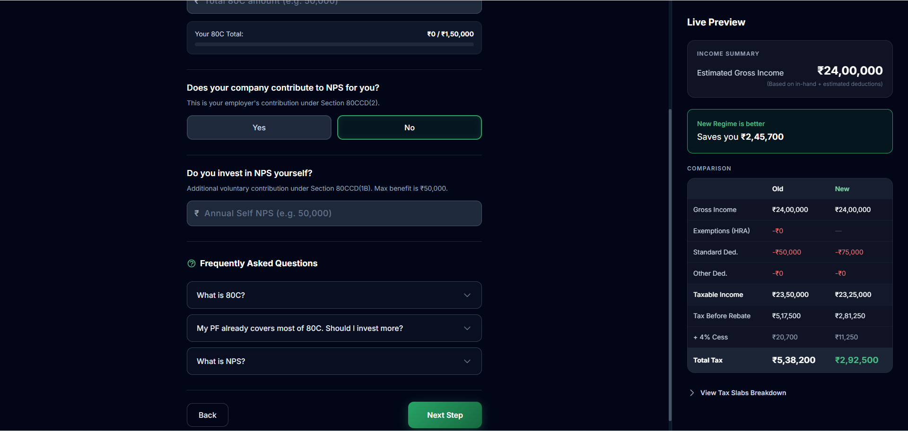

# Indian Income Tax Calculator (FY 2025-26) 🇮🇳

A modern, accurate, and interactive Indian Income Tax Calculator built with **React**, **Vite**, and **Tailwind CSS**. It helps users calculate their exact tax liability under both the **Old Regime** and **New Regime** and clearly shows which option saves more money.

Built as part of the **Codebasics AI Pro** program (Session #2 Assignment).

---

## Screenshots

### Landing Page


### Step-by-Step Wizard with Live Preview

| Step | Screenshot |
|------|-----------|
| **Step 1:** Salary & Age |  |
| **Step 2:** PF, Professional Tax & Bonus |  |
| **Step 3:** Rent (HRA) |  |
| **Step 4:** 80C Investments & NPS |  |
| **Step 5:** Health Insurance (80D) |  |
| **Step 6:** Home Loan |  |
| **Step 7:** Other Income |  |

### Final Results — Regime Comparison


---

## Demo Video

📹 [Watch the full walkthrough](https://github.com/Jaideepgupta/Indian-Income-Tax-Calculator-/blob/main/tax%20calculator.mp4?raw=true)

---

## Features

- **Dual-Regime Comparison** — Calculates and compares Old vs New tax regime side by side in real time.
- **7-Step Guided Wizard** — Walks users through salary, allowances, rent, investments, health insurance, home loan, and other income without overwhelming them.
- **Real-Time Live Preview** — A persistent side panel updates instantly as you type, showing final tax under both regimes and recommending the better one.
- **Accurate Tax Engine (FY 2025-26)**
  - Section 87A rebate (up to ₹7L New / ₹5L Old)
  - Standard Deduction (₹75K New / ₹50K Old)
  - HRA Exemption
  - Section 80C, 80D (Health Insurance), NPS (80CCD)
  - Home Loan Interest (Section 24)
  - Professional Tax
- **Interactive Slab Breakdown** — Expandable accordion showing exact step-by-step math across each tax slab.
- **Smart Tax-Saving Suggestions** — Analyzes user inputs and recommends specific actions to reduce tax liability.
- **Built-in FAQ on Every Step** — Contextual FAQs in plain language so users understand what each input means.
- **Responsive UI** — Dark-themed glassmorphism design with smooth micro-interactions.

---

## Tech Stack

- **Frontend:** React 18
- **Build Tool:** Vite
- **Styling:** Tailwind CSS
- **Icons:** Heroicons (SVG)

---

## Running Locally

**Prerequisites:** [Node.js](https://nodejs.org/) installed on your machine.

```bash
# Clone the repository
git clone https://github.com/Jaideepgupta/Indian-Income-Tax-Calculator-.git
cd Indian-Income-Tax-Calculator-

# Install dependencies
npm install

# Start the development server
npm run dev
```

Open `http://localhost:5173` in your browser.

---

## Project Structure

```
src/
├── components/
│   ├── Wizard/          # 7-step data entry forms
│   ├── LivePreview/     # Real-time regime comparison panel
│   ├── Results/         # Final breakdown and smart suggestions
│   └── shared/          # Reusable UI components
├── engine/              # Core tax calculation logic
├── hooks/               # Custom React hooks
├── utils/               # Helper functions
├── App.jsx
└── main.jsx
```

---

## Future Improvements

- Surcharge calculation for income above ₹50 Lakh
- PDF export of tax summary
- Capital gains support (STCG / LTCG)
- Freelance and business income section
- Multi-year comparison (FY 2024-25 vs 2025-26)
- Live deployment

---

## Acknowledgements

Built as part of the [Codebasics AI Pro](https://codebasics.io) program. Thanks to **Hemanand Vadivel**, **Naveen S**, **Aditya Goel**, **Dhaval Patel**, and the Codebasics community for the guidance and learning experience.

---

## Connect

- **LinkedIn:** [Jaideep Gupta](https://www.linkedin.com/in/guptajaideep/)
- **Portfolio Website:** [Jaideep Gupta](https://codebasics.io/portfolio/Jaideep-Gupta)

---

## License

This project is licensed under the [MIT License](LICENSE).
